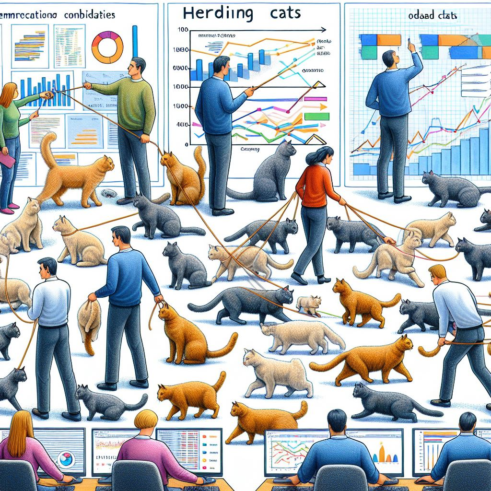

# Data Wrangling

Imagine you're a data scientist working on a project that involves multiple data sources, each with its own format, structure, and quality. You need to gather, clean, and integrate all this data to build a cohesive model. This process can feel like "herding cats" because:

1. **Data Variety**: Each data source is different, like cats with their own personalities. Some data might be structured, some unstructured, and others semi-structured.
2. **Data Quality**: Ensuring all data is clean and reliable is challenging. Some data might be incomplete, outdated, or inconsistent, much like trying to get a group of cats to follow the same rules.
3. **Stakeholder Management**: You often have to coordinate with various stakeholders, each with their own priorities and expectations. It's like trying to get a group of cats to move in the same direction.
4. **Tool Integration**: Using different tools and technologies to process and analyze data can be complex. It's akin to managing a group of cats with different needs and behaviors.

In essence, "herding cats" in data science refers to the complexity and coordination required to manage diverse and often unruly data sources and processes. 🐱📊

Have you encountered any specific challenges in your data science projects that felt like herding cats? If you have not then, you are about to!

## Files Associated with this Exercise

* [Data Wrangling Presentation](https://docs.google.com/presentation/d/1xjQFqY-yl6SOBQHTIhQtp5fjqwVQCrjAMYu68Oj_XUE/edit?usp=sharing)
* [Data Wrangling Google Sheet](https://docs.google.com/spreadsheets/d/1nyXAqAu_UaUvaglZl79WU5EyCgLNfaZMafavlnkH_jY/edit?usp=sharing)

